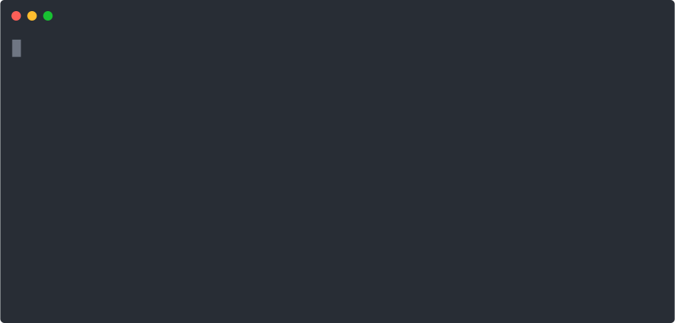

[]()
--------------------------------  
#### A simple rehabilitation program for coping with long days of programming  

<p align="right">
  <!-- CI Status -->
  <a href="https://travis-ci.org/tterb/Urban-Dictionary-Therapy"></a>
  <!--Project version-->
  <a href="https://pypi.python.org/pypi/UDTherapy/"></a>
  <!-- Python version -->
  <a href="https://docs.python.org/3/"></a>
  <!--License-->
  <a href="https://opensource.org/licenses/MIT"></a>
</p>  

<br>

<p align="center">
  
  <!--  -->
</p>

## Description:  
**Urban Dictionary Therapy** is a simple command-line rehabilitation program for coping with long frustrating days of programming. Utilizing this program and the information generously donated by the online community, you too can return to your work as a more successful, functioning member of society. More importantly, Urban Dictionary Therapy provides you with the much needed liberation without the distraction that inevitably comes with opening up a new tab in your browser. Though, this is only one of the many wonderful ways this package can benefit your life.  
  
Maybe you're looking for a substitute for the obligatory ```fortune``` package in your command-line greeting or just simply looking for a way to expand your vocabulary?  
No matter what the issue, ***Urban Dictionary Therapy*** provides a perfect answer to all your woes.  
  
  
## Install  
The program can be installed with the following commands:  

```sh
$ pip install UDTherapy
```
  
## Usage  
The program can be executed as shown:  

```sh
$ UDTherapy [-options]
```
  
#### Options  

| Arguments       |                                                  |
|-----------------|--------------------------------------------------|
| `-s, --search`  |  Display a definition for the specified term     |
| `-n, --num`     |  Specify the number of definitions to display    |
| `-a, --all`     |  Display an entire page of definitions           |
| `-w, -wotd`     |  Display the "*Word of the Day*"                 |
| `-v, --version` |  Display the program version number and exit     |
| `-h, --help`    |  Display information on usage and functionality  |  
  
<br>

## Contributing  
If you'd like to contribute to the project, feel free to suggest a [feature request](./../../issues/new?template=feature_request.md) and/or submit a [pull request](./../../pulls?q=is%3Apr+is%3Aopen+sort%3Aupdated-desc).  
  